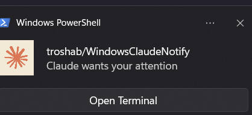

# WindowsClaudeNotify

Windows toast notifications for [Claude Code](https://docs.anthropic.com/en/docs/claude-code) with **automatic tab switching** in Windows Terminal.



## Features

- **Automatic tab switching** - identifies and switches to the correct Windows Terminal tab when multiple Claude Code sessions are open
- **Real messages** - shows the actual Claude Code notification text (permission prompts, task completion, etc.)
- **No window resize** - restores minimized windows without un-maximizing (uses `SW_RESTORE`)
- **Toast button** - "Open Terminal" button in the toast uses a custom `claude-focus:` protocol to switch tabs even after the notification script exits
- **Silent wrapper** - VBS launcher prevents console window flash when clicking the toast button
- **Process tree analysis** - walks up the PID parent chain + uses `NtQueryInformationProcess` to map the calling Claude Code session to the correct WT tab

## Requirements

- Windows 10/11
- Windows Terminal
- PowerShell 5.1+ (included with Windows)
- [Claude Code](https://docs.anthropic.com/en/docs/claude-code) CLI

## Quick Install

Clone and run the installer:

```powershell
git clone https://github.com/tro/WindowsClaudeNotify.git
cd WindowsClaudeNotify
powershell -ExecutionPolicy Bypass -File install.ps1
```

## Manual Install

1. Create `%LOCALAPPDATA%\ClaudeNotify\` directory
2. Copy files:
   - `src/notify.ps1` -> `%LOCALAPPDATA%\ClaudeNotify\notify.ps1`
   - `src/focus.ps1` -> `%LOCALAPPDATA%\ClaudeNotify\focus.ps1`
   - `src/focus.vbs` -> `%LOCALAPPDATA%\ClaudeNotify\focus.vbs`
   - `assets/claude.png` -> `%LOCALAPPDATA%\ClaudeNotify\claude.png`
3. Register the `claude-focus:` protocol (run in PowerShell as current user):
   ```powershell
   $key = "HKCU:\Software\Classes\claude-focus"
   New-Item -Path "$key\shell\open\command" -Force | Out-Null
   Set-ItemProperty -Path $key -Name "(Default)" -Value "Claude Focus Protocol"
   Set-ItemProperty -Path $key -Name "URL Protocol" -Value ""
   $vbs = "$env:LOCALAPPDATA\ClaudeNotify\focus.vbs"
   Set-ItemProperty -Path "$key\shell\open\command" -Name "(Default)" -Value "wscript.exe `"$vbs`" `"%1`""
   ```
4. Add the hook to `~/.claude/settings.json`:
   ```json
   {
     "hooks": {
       "Notification": [
         {
           "matcher": "",
           "hooks": [
             {
               "type": "command",
               "command": "powershell.exe -NoProfile -ExecutionPolicy Bypass -File \"%LOCALAPPDATA%\\ClaudeNotify\\notify.ps1\""
             }
           ]
         }
       ]
     }
   }
   ```

## How It Works

```
Claude Code (notification hook)
    |
    v
notify.ps1 (reads hook JSON from stdin)
    |
    |-- 1. Finds WindowsTerminal process
    |-- 2. Restores window if minimized (SW_RESTORE)
    |-- 3. SetForegroundWindow()
    |-- 4. Walks process tree: PID -> parent -> ... -> WT
    |       Maps to shell children of WT, sorted by StartTime
    |       Determines tab index
    |-- 5. UI Automation: SelectionItemPattern.Select() on TabItem
    |-- 6. Shows toast notification with tab index in button URL
    |
    v
Toast button click -> claude-focus:{tabIndex}
    |
    v
focus.vbs (silent launcher, no console flash)
    |
    v
focus.ps1 (parses URI, focuses WT, switches tab via UI Automation)
```

### Tab detection explained

The key challenge is mapping "which Claude Code session triggered this notification" to "which Windows Terminal tab should we switch to":

1. **WT spawns shell processes** - each tab has a shell (pwsh, bash, cmd) as a direct child of the WindowsTerminal process
2. **Process tree walking** - from the notification script's PID, walk up the parent chain using `NtQueryInformationProcess` until we hit the WT process
3. **Shell matching** - find which direct child shell of WT is in our ancestor chain
4. **Index mapping** - shells sorted by `StartTime` correspond to tab order (left to right)
5. **UI Automation** - enumerate `TabItem` elements via the Windows Automation API and call `SelectionItemPattern.Select()` on the matching index

## Configuration

### Hook matcher patterns

The `matcher` field in `settings.json` filters which notifications trigger the hook. An empty string matches all notifications.

Examples:
```json
{ "matcher": "permission" }
{ "matcher": "idle|permission|error" }
```

### Custom icon

Replace `%LOCALAPPDATA%\ClaudeNotify\claude.png` with any PNG image.

## Uninstall

1. Remove the hook entry from `~/.claude/settings.json`
2. Delete `%LOCALAPPDATA%\ClaudeNotify\` directory
3. Remove the protocol registry key:
   ```powershell
   Remove-Item -Path "HKCU:\Software\Classes\claude-focus" -Recurse -Force
   ```

## License

[MIT](LICENSE)
